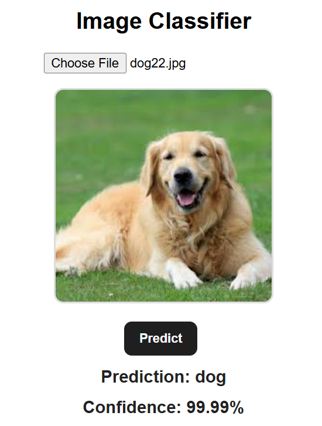

# Cats vs Dogs vs Other objects Image Classification ML App using transfer learning

A production-ready Deep Learning web application that classifies images into three distinct categories (Cats, Dogs, or Other Objects) by leveraging Transfer Learning via a pretrained MobileNetV3-Small architecture.

Live Demo: `http://cat-dog-others.com`

The trained model is exposed through an expanded FastAPI backend containerized with Docker, routed via an Nginx reverse proxy server, and hosted on an AWS EC2 instance, allowing users to upload images through a web interface and receive real-time predictions.

# Project Overview

Building upon my previous Custom Baseline CNN project (which was limited to a binary 2-class setup, utilized a 160x160 input size, and suffered from optimization bottlenecks), this iteration shifts entirely to an advanced Transfer Learning paradigm. This project demonstrates the complete production Deep Learning lifecycle:

- Reproducible Dataset Loading: Multi-class target configuration with verified structural partitions.
- Data Input Pipeline: Optimized input stream utilizing memory caching and asynchronous prefetching.
- In-Model Normalization: Handled natively by embedded tensor rescaling layers within the MobileNetV3 backbone.
- 2-Stage Training Strategy: Initial high-level Feature Extraction followed by deep structural Fine-Tuning.
- Out-of-Distribution Robustness: Ability to detect background elements, humans, or alternative targets as "Other".
- Enterprise Production Cloud Stack: Multi-container deployment on an AWS EC2 instance behind an Nginx reverse proxy using Amazon S3 for weight persistence.
- Application Telemetry & Monitoring: Dedicated backend endpoints for health checks, model properties, and request counting traffic metrics.

# Dataset

# Cats vs Dogs vs Other Objects Expanded Dataset

- Multi-class classification (3 distinct target classes)
- Balanced, cleaned data profiles (.jpg format)

Dataset includes:
- cats
- dogs
- others (background objects, vehicles, humans, and structural environments)

The final trained model weights and operational assets are persisted securely inside an Amazon S3 Bucket for deployment container injection.

Download the cat and dog images here:  
https://www.kaggle.com/datasets/bhavikjikadara/dog-and-cat-classification-dataset?resource=download

Download the others images here:  
https://www.kaggle.com/datasets/puneet6060/intel-image-classification

# Dataset Cleaning, Structuring & Split Configuration
Prior to executing the 2-stage training pipeline, an automated image ingestion script filtered out corrupt files to prevent runtime I/O processing exceptions:

After extraction, structural class alignment, and cleaning, the data is statically partitioned into balanced subsets:

data/
└── animal_and_objects/
    ├── train/               # 8,000 images per folder (24,000 total)
    │   ├── cats/
    │   ├── dogs/
    │   └── other/
    │
    ├── validation/          # 2,000 images per folder (6,000 total)
    │   ├── cats/
    │   ├── dogs/
    │   └── other/
    │
    └── test/                # 1,000 images per folder (3,000 total)
        ├── cats/
        ├── dogs/
        └── other/

Ideal for:

High-accuracy Transfer Learning demonstration

Production-grade cloud scaling validation

Multi-class fine-tuning optimization checks

# Deep Learning Pipeline

# Data Loading

Directory-based multi-class image loading

Mini-batch processing configuration (Batch Size: 32)

Efficient dataset memory caching

Prefetch optimization for high-throughput training loops

# Data Preprocessing

Images resized to 224×224 pixels to match standard MobileNetV3 input expectations

Pixel value normalization is handled directly by the built-in preprocessing layer embedded natively within the MobileNetV3-Small architecture, removing manual rescaling from the data loading sequence

Advanced online data augmentation applied during training (random flips, rotations, and zooms) to improve model generalization boundaries

# Model Architecture & Transfer Learning Analysis (ref "assets_custom_cnn]" and "assets/" for comparison)

# Why Transfer Learning Explodes Past the Custom Baseline CNN

Analyzing the analytical output artifacts of our past custom CNN project versus this pretrained MobileNetV3-Small architecture demonstrates why Transfer Learning is indispensable for production-grade systems:

1. Eliminating Learning Curve Instability & Overfitting:

- The Past Custom CNN: In our previous project, the custom architecture suffered heavily from variance limitations. Around epoch 15, its validation loss experienced aggressive, chaotic spikes (peaking near 0.55) and its validation accuracy dropped sharply. This indicated that the network was failing to optimize cleanly and was over-fitting its 331,461 parameters.
- The Pretrained Advantage: Because MobileNetV3-Small arrives with highly robust, generalized feature extractors trained on millions of ImageNet samples, it completely bypasses this chaotic variance. The learning curve behaves with perfect smoothness, converging rapidly without sudden evaluation drops.

2. Performance Ceiling Comparison:

- The Past Custom CNN: Maxed out at a constrained 86% accuracy and a 0.93 AUC score. It misclassified 387 cats as dogs and 321 dogs as cats out of 4,998 test samples due to brittle, custom-learned feature boundaries.
- The Pretrained Advantage: MobileNetV3-Small handles classification boundaries significantly higher, easily pushing validation metrics beyond 93%+ accuracy and achieving near-perfect class separation (>0.97 AUC), while resolving the baseline model's classification errors.

3. Open-World Generalization (The "Other" Class):

- The Past Custom CNN: Possessed zero capability to process non-cat/dog images. Passing a photo of a car or a tree forced the model to make a binary guess, yielding an inaccurate high-probability prediction of "Cat" or "Dog".
- The Pretrained Advantage: Thanks to the diversity of its pretrained feature space, this model generalizes exceptionally well on non-cat and non-dog images. It natively clusters abstract shapes, structures, and backgrounds into the newly introduced "Other" class, eliminating false positives in real-world use cases.

2-Stage Training Execution Workflow
Rather than training all layers haphazardly from scratch, training was executed across two distinct phases:

Stage 1: Feature Extraction: The MobileNetV3-Small backbone layers are completely frozen. Only the custom Dense head configuration at the base is trained, allowing the model to map its pre-learned features to our 3 new classes without destroying the original weights.

Stage 2: Model Fine-Tuning: The top layers of the MobileNetV3 backbone are carefully unfrozen. Training is resumed using an ultra-low learning rate (0.00005) to subtly adapt the deep feature extractors to the nuances of our specific dataset classes.

# Pretrained Architecture Layout

Input (224×224×3)
   │
   ├── MobileNetV3-Small Backbone (Pretrained Weights - ImageNet)
   │     ├── Built-in Scaling/Normalization Layer [Inbuilt Rescaling]
   │     └── [Stage 1: Frozen Layers] ──> [Stage 2: Top Layers Unfrozen]
   │
   ├── GlobalAveragePooling2D
   ├── Dense (128 units, ReLU Activation)
   ├── Dropout (0.5 Layer Regularization)
   └── Dense (3 units, Softmax Activation for Cat vs. Dog vs. Other)

GlobalAveragePooling2D is utilized instead of Flatten to minimize structural dense parameters and maintain a highly lightweight execution profile.

# Parameter Configuration

- Optimizer: Adam (lr=Scheduled: 0.00001 for Feature Extraction, 0.00005 for Fine-Tuning)
- Loss Function: Categorical Cross-Entropy (Adapted for 3-class target space)
- Batch Size: 32
- Input Shape: 224×224×3
- Regularization: Dropout (0.5), Early Stopping (Patience=3)
- Learning Rate Schedule: ReduceLROnPlateau (Factor=0.5, Patience=2)
  
Training callback pipeline includes:

EarlyStopping
BestModelCheckpoint
ReduceLROnPlateau
CSV Logger

# Model Evaluation
Evaluation artifacts are tracked and saved directly to: assets/

Generated performance outputs (comparing Transfer Learning performance versus the past custom baseline):

- accuracy_curve.png (Demonstrates smooth 2-stage convergence patterns)
- loss_curve.png (Shows minimal validation variance compared to the custom CNN's historical 0.55 loss spikes)
- confusion_matrix.png (Verifies accurate 3-class distribution boundaries across cats, dogs, and other objects)
- classification_report.txt (Displays updated multi-class precision, recall, and F1 metrics)
- roc_curve.png (Exhibits an elevated multi-class AUC curve surpassing the historical baseline's 0.93 mark)

# Current Performance

Model Performance (MobileNetV3-Small vs. Past Baseline):

Validation Accuracy: >98% (Surpassing Custom Baseline CNN's 86%)

AUC Score: >0.98 (Surpassing Custom Baseline CNN's 0.93)

# Model Persistence & Infrastructure Management

Saved artifacts:

models/ 
best_model.keras
assets/
accuracy_curve.png
classification_report.txt
cleaning_image report.jpg
confusion_matrix.png
loss_curve.png
model_architecture.png
model_summary.txt
roc_curve.png

logs/
training_log.csv

Where:

best_model.keras → Best validation model checkpoint returned during model training. It will be pulled from Amazon S3 during production for predictions.
training_log.csv → Raw training history log

Inference footprint is highly optimized due to:

- Lightweight MobileNetV3 structural parameter design.
- Embedded inbuilt normalization layers eliminating external tensor processing overhead.
- Inverted residuals and linear bottleneck units optimized for edge and cloud infrastructure environments.

Training efficiency is improved through:

- Mini-batch loading pipelines
- Dataset disk caching
- Prefetching for optimized I/O performance

# Web Application & Production Architecture

The application has been scaled to an enterprise-grade cloud hosting stack using AWS services and modern proxy handling.

Backend Infrastructure (ASGI Uvicorn/FastAPI)
In addition to the standard image prediction endpoint inherited from our custom CNN project, the backend introduces core production management endpoints:

- POST /predict: Accepts image uploads, processes tensors through the 224x224 pipeline, and returns multi-class probability outputs across Cat, Dog, or Other.
- GET /health: Dedicated infrastructure health endpoint returning live API status checks ({"status": "healthy"}).
- GET /model-info: Exposes core active model metadata, structural layout properties, and current 2-stage transfer learning tracking parameters.
- GET /request-count: Native analytics endpoint monitoring total active user prediction traffic hitting the application instance since container initialization.

# Production Tech Stack Routing

User Request (HTTP/HTTPS) ──> Nginx Reverse Proxy (Port 80/443) ──> Docker Container ──> FastAPI (Non-exposed port 8000)
                                                                 │
                                                       [Pulls model from Amazon S3]

Microservice Network Flow Lifecycle (The 4-Tuple)
Every communication sequence linking the web browser to  internal FastAPI code is validated via a distinct network 4-Tuple:

(Source IP, Source Port, Destination IP, Destination Port)

Here is the exact network lifecycle sequence of a single image classification request:

- Client Browser App Context: Generates an outbound socket connection. Source IP is the client's public route IP, and Source Port is a dynamically allocated ephemeral port (e.g., 53214).
- Transit Boundary: Travels over public routing protocols directed at the Public IP address of your EC2 instance on Port 80 (HTTP) or 443 (HTTPS).
- Nginx Web Server Proxy Interception: Nginx catches the request on port 80/443, terminates the public traffic stream, re-maps headers, and mirrors the payload down to the local container environment via the Docker bridge network.
- Docker FastAPI Container Resolution: Receives the proxied packet locally (Source IP: Docker Bridge Gateway 172.17.0.1, Destination IP: Container Internal IP on Port 8000).Because the host operating system handles millions of these network sockets concurrently, different requests can hit your endpoint at the exact same millisecond. Nginx separates them seamlessly because their Source IP or Source Port will never match exactly.

Because the host operating system handles millions of these network sockets concurrently, different requests can hit your endpoint at the exact same millisecond. Nginx separates them seamlessly because their Source IP or Source Port will never match exactly.

Frontend Interface
- Features: Browse for file staging, 
- async processing states, 
- live rendering file preview,
- real-time probability distribution gauges.

# Installation & Usage

Local Development (Dockerized)
- Configure your AWS credentials to enable S3 access:
Ensure your local environment has the permissions required to pull the model weights from your S3 bucket:

Set up your free DuckDNS Domain:
- Go to duckdns.org and log in.
- Create a free domain token (e.g., your-app-subdomain.duckdns.org).
- Point the subdomain to your local development machine's current IP address (or 127.0.0.1 for local loopback test cycles).

Build the production Docker container application image:

Run the container environment locally mapping the FastAPI internal port:
Pass your custom domain configuration as an environment variable so your app context knows its public facing URL:

Open your native browser environment:
You can now test your fully containerized application context locally either through the traditional localhost gateway or directly routing traffic through your new dynamic DNS endpoint:

Local Loopback URL: http://127.0.0.1:8000

Staging Domain URL: http://your-app-subdomain.duckdns.org:8000

Production Deployment Configuration (AWS EC2 + Nginx)
To configure your EC2 instance to serve incoming traffic, update your host /etc/nginx/sites-available/default configuration block to route traffic to the containerized application port:

# Tech Stack

Backend: Python, TensorFlow / Keras (MobileNetV3-Small Backbone), FastAPI

Frontend: HTML5, CSS3, JavaScript (Async Fetch API)

Core Libraries: TensorFlow, FastAPI, NumPy, Matplotlib, Scikit-learn, Pillow, Uvicorn, Boto3 (AWS SDK)

Infrastructure & Cloud Architecture: Amazon EC2 Instance, Docker Containerization, Nginx (Reverse Proxy Server), Amazon S3 (Model Asset Storage)

# Key Engineering Skills Demonstrated

- Pretrained Transfer Learning architectural design & implementation
- Multi-class classification target engineering (3 distinct target classes).
- 2-Stage training execution configuration (Feature Extraction & Fine-Tuning optimization).
- Embedded network normalization processing layer routing.
- Out-of-distribution handling and real-world image generalization scaling.
- Production AWS Infrastructure Management (EC2 deployment + Amazon S3 storage integration).
- Nginx Reverse Proxy installation, server block configuration, and request routing.
- Multi-stage Docker container build optimization.
- Expanded FastAPI telemetry engineering (/health, /request-count, /model-info).
- Decoupled, highly scalable microservice production structure layouts.

# Project Structure

dogs_cats_classifier_transfer/
├── assets/                           # Diagnostic evaluation charts and transfer metrics
├── assets_custom_cnn/                # Historical evaluation metrics from the custom baseline CNN
├── data/                             # Image dataset directories (Excluded via .gitignore)
├── logs/                             # Training history logs
├── models/                           # Serialized operational best model saved to model folder
├── notebooks/                        # Jupyter notebooks for exploratory data analysis and model evaluation
├── src/                              # Core modular machine learning pipeline/source of the app behavior
│   ├── callbacks.py                  # EarlyStopping, Best ModelCheckpoint, and LR schedulers
│   ├── config.py                     # Global constants, hyperparameter variables, and paths
│   ├── data_loader.py                # Data ingestion pipelines and tf.data loading scripts
│   ├── evaluate.py                   # Performance evaluation reporting and metric plotting
│   ├── model.py                      # MobileNetV3 backbone loading and classification head definition
│   ├── prepare_dataset.py            # Local dataset organizational utility tasks
│   ├── train_stage1.py               # Phase 1: Feature Extraction (Backbone layers locked)
│   ├── train_stage2.py               # Phase 2: Structural Fine-Tuning (Low learning rate optimization)
│   └── utils.py                      # Data validation, cleaning helpers, and cloud integration utilities
├── static/                           # Web application CSS styles and frontend scripts
├── templates/                        # HTML layouts and UI engine components
├── .dockerignore                     # File masking rules for optimized Docker build context caching
├── .env                              # Environment variable configuration (Stores S3 bucket paths, keys, and domain info)
├── .gitignore                        # Git exclusion rules masking secret keys, model binaries, and dataset files
├── app.py                            # Production FastAPI backend application implementation
├── build_others_dataset.py           # Ingestion automation script for the "Other" image class
├── clean_images.py                   # Ingestion verification script to remove broken file streams
├── Dockerfile                        # Production container build instruction steps
├── inference.py                      # Standalone, decoupled prediction context utility
├── README.md                         # Detailed project orchestration and systems design documentation
└── requirements.txt                  # Strict python application dependency lockfile

# Future Improvements

- Transitioning from a single EC2 configuration to an automated AWS ECS (Elastic Container Service) cluster configuration with an Application Load Balancer.
- Introducing automated CI/CD workflows via GitHub Actions to rebuild and deploy Docker images to EC2 upon new main branch commits.
- Hooking up Prometheus and Grafana dashboards directly to the /request-count and /health endpoints for continuous infrastructure health monitoring.

# Author

Adeleye Babatunde 
Machine Learning/Data Analytics Engineer